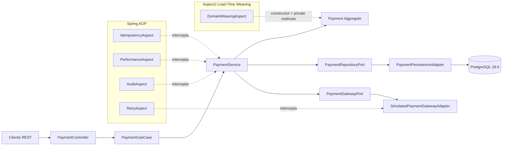

# Payment Processing con Spring AOP + AspectJ

Esta PoC la armé para probar AOP de verdad en un microservicio y no quedarme en el ejemplo típico de imprimir logs con un `@Around`. El caso funcional es un flujo simple de payment processing: crear/autoriziar un pago, consultarlo, capturarlo y devolverlo. Sobre ese flujo implementé concerns transversales con Spring AOP y, donde los proxies de Spring ya no alcanzan, uso AspectJ Load-Time Weaving.

La idea principal es separar dos niveles:

- **Spring AOP** para interceptar beans administrados por Spring: idempotencia, auditoría, medición y retry.
- **AspectJ weaving** para interceptar join points del dominio que no dependen de proxies: construcción de `Payment` y ejecución de métodos privados.

Con esto se puede comparar en el mismo proyecto qué resuelve un proxy y qué resuelve realmente AspectJ.

## Stack usado

| Tecnología | Versión / criterio | Uso |
|---|---|---|
| Java | 25 | Runtime y compilación |
| Spring Boot | 4.1.1 | Base del microservicio |
| Spring Framework | 7.x administrado por Boot | Web, AOP, transacciones |
| AspectJ Weaver | 1.9.25.1 | Load-Time Weaving |
| Maven | 3.6.3+ | Build |
| PostgreSQL | 18.6 | Persistencia de pagos, auditoría e idempotencia |
| Flyway | Versión administrada por Boot | Creación y evolución de esquema |

No agregué Kafka, MongoDB, Neo4j, Qdrant, KurrentDB, InfluxDB ni Drools porque ninguno es necesario para demostrar el caso técnico. Meterlos aquí haría más pesada la PoC sin mejorar la prueba de AOP.

## Caso de uso funcional

El servicio simula un procesador de pagos con este flujo:

1. Se crea un pago con una llave de idempotencia.
2. El servicio llama a un gateway de pagos simulado para autorizarlo.
3. Si el gateway responde bien, el pago queda `AUTHORIZED`.
4. El pago puede pasar a `CAPTURED`.
5. Luego puede pasar a `REFUNDED`.
6. Si se intenta una transición inválida, el dominio la rechaza.

El monto `13.37` tiene un comportamiento especial solo para la PoC: el gateway falla transitoriamente en los dos primeros intentos y funciona en el tercero. Eso permite comprobar el aspecto de retry sin depender de un proveedor externo.

## Caso de uso técnico: AOP y AspectJ

Esta es la parte principal del proyecto.

### 1. Idempotencia declarativa

`PaymentService.create(...)` usa:

```java
@IdempotentOperation(key = "#command.idempotencyKey()")
```

`IdempotencyAspect` hace lo siguiente:

- usa SpEL para obtener dinámicamente la llave declarada en la anotación;
- consulta `idempotency_records`;
- si ya existe una respuesta completada, la reconstruye y evita ejecutar otra vez el caso de uso;
- si es una ejecución nueva, registra el inicio;
- al terminar guarda la respuesta serializada;
- si ocurre un error elimina el registro incompleto para permitir un retry posterior.

Esto evita meter lógica de idempotencia dentro del caso de uso de pagos.

### 2. Retry para fallas transitorias

El adapter del gateway usa:

```java
@RetryTransient(maxAttempts = 3, backoffMs = 75)
```

`RetryAspect` aplica retry solo sobre `TransientGatewayException`. No reintenta cualquier excepción porque eso sería peligroso en pagos.

El backoff aumenta por intento y el número máximo de intentos queda declarado en la anotación.

### 3. Auditoría de resultado

Los métodos que cambian el estado del pago usan `@Auditable`.

`AuditAspect` implementa dos tipos de advice:

- `@AfterReturning` para registrar operaciones exitosas;
- `@AfterThrowing` para registrar operaciones fallidas.

Los eventos se guardan en `audit_events` y no están mezclados con la lógica de negocio.

### 4. Métricas y detección de operaciones lentas

`@MeasuredOperation` permite nombrar cada operación y definir un umbral.

`PerformanceAspect`:

- mide el tiempo con `System.nanoTime()`;
- registra un `Timer` de Micrometer;
- publica la métrica `payment.aop.operation`;
- genera warning solo cuando la operación supera el umbral configurado.

Las métricas quedan disponibles mediante Actuator.

### 5. Orden explícito de aspectos

Los aspectos tienen orden definido con `@Order`:

| Orden | Aspecto | Objetivo |
|---:|---|---|
| 0 | `IdempotencyAspect` | Evitar que una ejecución duplicada llegue al caso de uso |
| 10 | `RetryAspect` | Reintentar llamadas transitorias del gateway |
| 20 | `PerformanceAspect` | Medir la operación completa |
| 30 | `AuditAspect` | Registrar el resultado final |

Esto evita depender del orden accidental en que Spring encuentre los aspectos.

### 6. AspectJ Load-Time Weaving sobre el dominio

`DomainWeavingAspect` no es un bean de Spring. Se declara en:

```text
src/main/resources/META-INF/aop.xml
```

El weaver está restringido a:

```text
pe.axiz.payment.domain..*
```

Eso es intencional. No conviene tejer todo el classpath porque aumenta costo, ruido y posibilidad de efectos laterales.

El aspecto captura dos join points que muestran la diferencia con Spring AOP:

```java
initialization(pe.axiz.payment.domain.model.Payment.new(..))
execution(private * pe.axiz.payment.domain.model.Payment.*(..))
```

Con eso se puede observar:

- construcción de objetos de dominio que no son beans de Spring;
- ejecución de métodos privados del agregado;
- llamadas internas que no pasan por un proxy de Spring.

El endpoint `/api/v1/aop/diagnostics` expone contadores de estos join points para poder verificar el weaving desde fuera.

## Arquitectura



## DDD + hexagonal

La organización evita que el dominio dependa de Spring, JPA o HTTP.

```text
payment-aspectj-poc/
├── datasets/
│   └── load-demo.sh
├── infraestructura/
│   ├── docker-compose.yml
│   ├── requests.http
│   └── responses/          respuestas de referencia
├── scripts/
│   └── run-with-aspectj.sh
├── src/
│   ├── main/
│   │   ├── java/pe/axiz/payment/
│   │   │   ├── application/       casos de uso, comandos y puertos
│   │   │   ├── domain/            agregado Payment, Money y reglas
│   │   │   └── infrastructure/    REST, AOP, JPA y gateway
│   │   └── resources/
│   │       ├── db/migration/      Flyway
│   │       └── META-INF/aop.xml   configuración del weaver
│   └── test/                      pruebas unitarias y de weaving
├── pom.xml
└── README.md
```

## Código principal

### `Payment`

Es el agregado. Mantiene el estado y controla sus transiciones:

```text
CREATED -> AUTHORIZED -> CAPTURED -> REFUNDED
```

La lógica de transición está en el dominio, no en el controller ni en JPA.

### `PaymentService`

Implementa el puerto de entrada `PaymentUseCase`. Orquesta dominio, persistencia y gateway. Las preocupaciones transversales se agregan mediante anotaciones y aspectos.

### `PaymentPersistenceAdapter`

Implementa `PaymentRepositoryPort`. Convierte entre el agregado y `PaymentEntity` para que JPA no contamine el dominio.

### `SimulatedPaymentGatewayAdapter`

Implementa `PaymentGatewayPort`. Sirve para probar el flujo sin integrar un PSP real. El monto `13.37` provoca dos fallas transitorias antes de responder correctamente.

### `DomainWeavingAspect`

Es el aspecto específico de AspectJ. Existe para demostrar join points que Spring AOP por proxy no puede cubrir.

## Endpoints en orden de ejecución

| Orden | Método | Endpoint | Función | Qué demuestra técnicamente |
|---:|---|---|---|---|
| 1 | POST | `/api/v1/payments` | Crea y autoriza un pago | idempotencia, auditoría, métricas, retry, weaving del dominio |
| 2 | GET | `/api/v1/payments/{id}` | Consulta el pago | puerto de entrada + persistencia hexagonal |
| 3 | POST | `/api/v1/payments/{id}/capture` | Captura un pago autorizado | auditoría, métricas y reglas de transición |
| 4 | POST | `/api/v1/payments/{id}/refund` | Devuelve un pago capturado | auditoría, métricas y reglas de transición |
| 5 | GET | `/api/v1/aop/diagnostics` | Muestra contadores del weaving | prueba que AspectJ interceptó constructor y métodos privados |
| 6 | GET | `/actuator/metrics/payment.aop.operation` | Consulta la métrica AOP | instrumentación generada por `PerformanceAspect` |

## Levantar infraestructura

La única infraestructura externa es PostgreSQL.

Desde la raíz:

```bash
cd infraestructura
docker compose up
```

No uso `-d` para que sea fácil ver cuándo PostgreSQL termina de iniciar.

El health check usa `pg_isready -q`, tiene intervalo de 30 segundos y no imprime el chequeo continuamente en los logs del contenedor.

Para apagarlo:

```bash
docker compose down
```

Para borrar también el volumen y empezar desde cero:

```bash
docker compose down -v
```

## Base de datos y Flyway

No hay scripts SQL duplicados dentro de `infraestructura`.

El esquema se administra únicamente con Flyway:

```text
src/main/resources/db/migration/V1__create_payment_tables.sql
```

Flyway crea:

- `payments`;
- `audit_events`;
- `idempotency_records`.

Hibernate está configurado con `ddl-auto: validate`, así que valida el modelo pero no crea ni modifica tablas por detrás.

## Compilar y ejecutar

### Requisitos

```text
JDK 25
Maven 3.6.3 o superior
Docker + Docker Compose
```

Validar versiones:

```bash
java -version
mvn -version
docker --version
docker compose version
```

### 1. Compilar y ejecutar pruebas

Desde la raíz:

```bash
mvn clean verify
```

El `maven-surefire-plugin` arranca las pruebas con:

```text
-javaagent:aspectjweaver-1.9.25.1.jar
```

Por eso `DomainWeavingAspectTest` no solo prueba el dominio: también comprueba que el constructor y los métodos privados fueron tejidos por AspectJ.

### 2. Levantar PostgreSQL

En otra terminal:

```bash
cd infraestructura
docker compose up
```

### 3. Ejecutar el servicio con AspectJ LTW

Desde la raíz:

```bash
./scripts/run-with-aspectj.sh
```

El script toma el `aspectjweaver` descargado por Maven y arranca el JAR con `-javaagent`.

Para ejecutarlo desde IntelliJ IDEA o un IDE similar, usar como VM option:

```text
-javaagent:$HOME/.m2/repository/org/aspectj/aspectjweaver/1.9.25.1/aspectjweaver-1.9.25.1.jar
```

El agente es necesario para los join points de AspectJ. Si se ejecuta sin él, Spring AOP seguirá funcionando, pero el contador de weaving del dominio no se incrementará.

## Precarga de datos

La carpeta `datasets` no toca directamente la base de datos. La carga entra por la API para recorrer exactamente los mismos aspectos y reglas que una llamada real.

Con el servicio arriba:

```bash
./datasets/load-demo.sh
```

El script crea:

- un pago normal por `49.90 PEN`;
- un pago por `13.37 PEN` para ejercitar el retry AOP.

También se puede cambiar la URL:

```bash
BASE_URL=http://localhost:8080 ./datasets/load-demo.sh
```

## Pruebas por curl

### Test 1. Crear y autorizar un pago

```bash
curl -i -X POST http://localhost:8080/api/v1/payments \
  -H 'Content-Type: application/json' \
  -H 'Idempotency-Key: demo-001' \
  -d '{"merchantReference":"order-1001","amount":150.50,"currency":"PEN"}'
```

Qué debería pasar:

- se ejecuta `IdempotencyAspect`;
- se crea un `Payment`;
- AspectJ intercepta la construcción del agregado;
- el gateway autoriza el pago;
- se ejecutan métodos privados del agregado y AspectJ los cuenta;
- se persiste el pago como `AUTHORIZED`;
- `AuditAspect` registra el resultado;
- `PerformanceAspect` registra el tiempo.

Respuesta esperada aproximada:

```json
{
  "id": "<uuid>",
  "merchantReference": "order-1001",
  "amount": 150.50,
  "currency": "PEN",
  "status": "AUTHORIZED",
  "gatewayReference": "gw_<uuid>",
  "createdAt": "<timestamp>",
  "updatedAt": "<timestamp>"
}
```

Guarda el `id` para las siguientes pruebas.

### Test 2. Repetir la misma solicitud

Ejecutar exactamente el mismo curl anterior usando nuevamente:

```text
Idempotency-Key: demo-001
```

Qué se prueba:

- el caso de uso no debe volver a procesar el pago;
- `IdempotencyAspect` devuelve la respuesta persistida;
- no se genera un segundo pago.

### Test 3. Forzar retry del gateway

```bash
curl -i -X POST http://localhost:8080/api/v1/payments \
  -H 'Content-Type: application/json' \
  -H 'Idempotency-Key: retry-001' \
  -d '{"merchantReference":"order-retry","amount":13.37,"currency":"PEN"}'
```

El adapter falla en los intentos 1 y 2 y responde en el 3. La llamada final debe terminar en `AUTHORIZED` sin que el caso de uso conozca la lógica de retry.

### Test 4. Consultar el pago

```bash
curl -s http://localhost:8080/api/v1/payments/<PAYMENT_ID>
```

Sirve para validar la lectura desde el adapter JPA a través del puerto hexagonal.

### Test 5. Capturar el pago

```bash
curl -i -X POST http://localhost:8080/api/v1/payments/<PAYMENT_ID>/capture
```

El estado debe cambiar de `AUTHORIZED` a `CAPTURED`.

### Test 6. Repetir capture para provocar una transición inválida

```bash
curl -i -X POST http://localhost:8080/api/v1/payments/<PAYMENT_ID>/capture
```

El dominio debe rechazar la transición y responder `400`. `AuditAspect` debe registrar la operación como fallida.

### Test 7. Refund

```bash
curl -i -X POST http://localhost:8080/api/v1/payments/<PAYMENT_ID>/refund
```

El pago debe quedar `REFUNDED`.

### Test 8. Comprobar AspectJ weaving

```bash
curl -s http://localhost:8080/api/v1/aop/diagnostics
```

Ejemplo:

```json
{
  "domainConstructorsWoven": 4,
  "privateDomainMethodsWoven": 7
}
```

Los números dependen de cuántas operaciones se hayan ejecutado, pero ambos deberían ser mayores a cero.

### Test 9. Consultar métricas del aspecto

```bash
curl -s http://localhost:8080/actuator/metrics/payment.aop.operation
```

Ahí se puede ver cuántas operaciones fueron medidas y su tiempo acumulado.

## Archivo de requests para el IDE

También dejé:

```text
infraestructura/requests.http
```

Se puede ejecutar desde IntelliJ IDEA y contiene requests para el pago normal, diagnósticos de weaving y escenario de retry.

## Decisiones importantes

### Por qué no usé solo Spring AOP

Spring AOP trabaja principalmente con proxies de beans de Spring. Eso está bien para servicios, adapters y concerns declarativos, pero no demuestra capacidades como:

- constructor join points;
- private method execution;
- objetos creados fuera del contenedor;
- ejecución interna dentro del mismo objeto sin pasar por un proxy.

Por eso la PoC usa ambos mecanismos y deja claro dónde encaja cada uno.

### Por qué no hice retry de cualquier excepción

En pagos un retry indiscriminado puede duplicar efectos externos. El aspecto solo reintenta `TransientGatewayException` y tiene límite de intentos.

### Por qué la idempotencia está persistida

Una `ConcurrentHashMap` hubiera sido más corta, pero no representa una implementación profesional: se pierde al reiniciar, no se comparte entre instancias y no sirve para escalar horizontalmente. PostgreSQL permite que el concepto se acerque más a un escenario real.

### Por qué Flyway y no SQL de Docker

Tener Flyway y scripts de inicialización del contenedor haciendo lo mismo crea dos fuentes de verdad. Aquí Flyway es el dueño del esquema.

## Límites intencionales de la PoC

No integré un PSP real ni seguridad OAuth2 porque distraería del caso técnico. El gateway es simulado y determinista para poder probar retry. Tampoco agregué mensajería o event sourcing porque no son necesarios para verificar los join points, advice, orden de aspectos, weaving, idempotencia, métricas y auditoría.

Si esto se llevara a producción, la siguiente evolución sería cambiar el gateway simulado por un adapter real y reforzar la exclusión mutua de la llave de idempotencia para múltiples instancias concurrentes.
